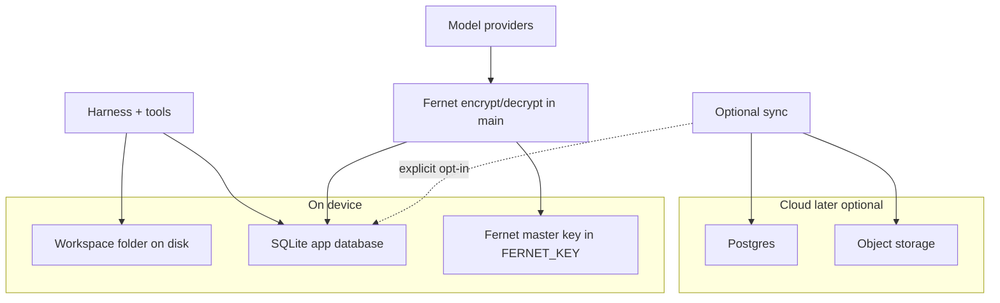
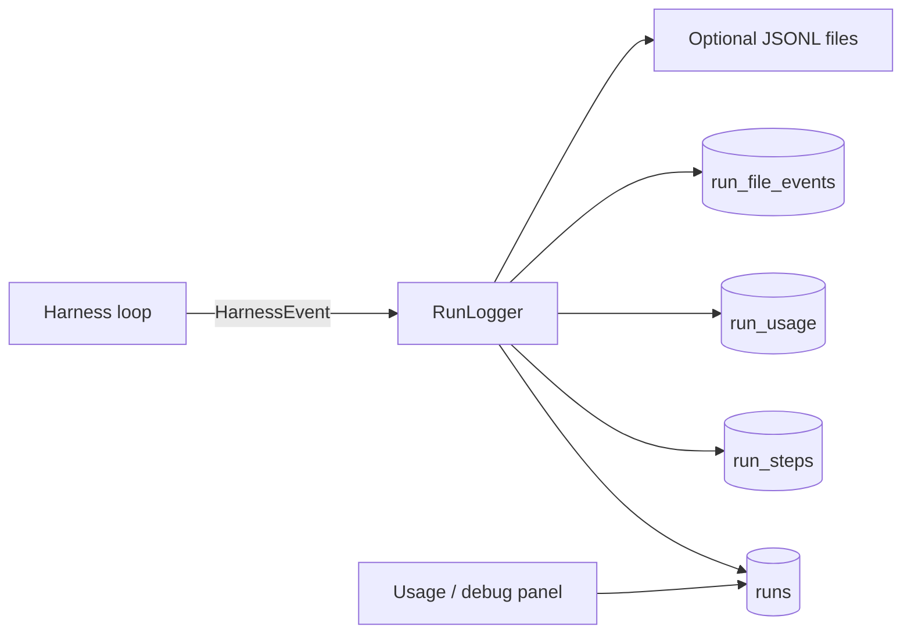
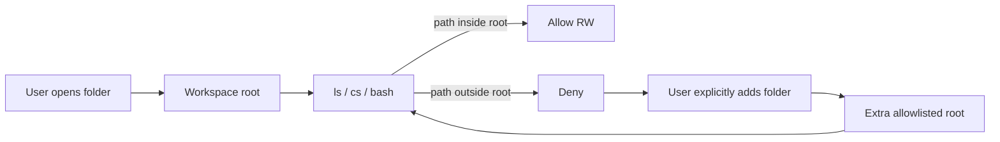
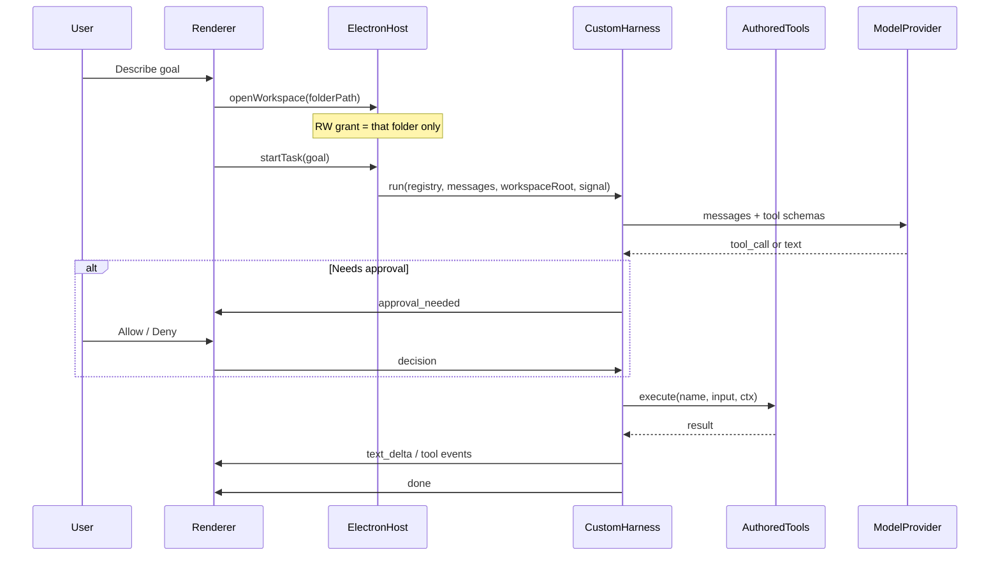
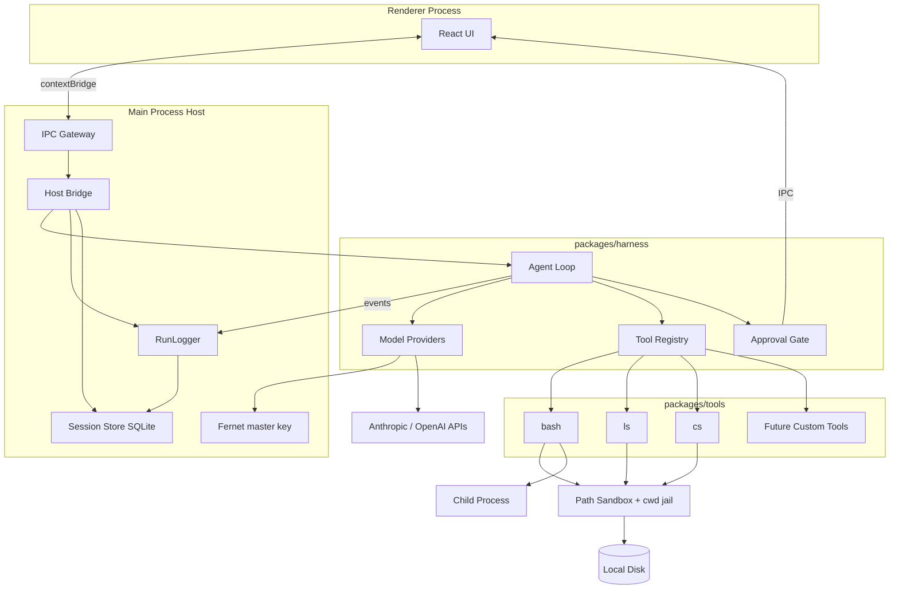

# Photon — Desktop AI Teammate Specs & Plan

> Status: planning (locked decisions below). Local-first MVP; hybrid cloud later.

## Product vision

Photon is a desktop app where you open a **workspace folder** and an agent finishes multi-step knowledge work there — create/edit files, organize docs, synthesize research — with shell/tool activity you can see and control. V1 is **local-first**. Later phases add connectors, schedules, named bots, and an optional cloud VM so work can continue when the laptop is closed.

**Positioning:** Cowork’s “work in my files” trust model + Grok Bot’s “teammate finishes the job” UX, without computer-use or cloud VM in MVP.

---

## Decisions locked

| Decision | Choice |
|---|---|
| Execution model | **Hybrid:** local agent + workspace folder now; cloud VM later |
| Workspace access | **One primary folder** with **read + write** for that folder only; anything outside requires an **explicit** extra grant |
| V1 scope | **MVP:** open workspace, chat, streaming agent, tool activity, bash approvals, **structured run logging** |
| V1 tools | **`bash`**, **`ls`**, **`cs`** (code search) — greenfield; no prior harness API |
| Out of V1 | Full computer use, browser automation, MCP marketplace, multi-bot, mobile, schedules |
| Platforms (V1) | macOS first (Apple silicon + Intel); Windows in Phase 1.5 |
| LLM access | BYO API keys (Anthropic + OpenAI-compatible); **Fernet-encrypted in SQLite** |
| Stack | Electron + React + TypeScript client; **Python (Django + DRF) server** owning the database |
| Agent runtime | **Custom Photon harness designed from scratch** — not LangChain / AI SDK agent / Claude Agent SDK. Thin provider adapters only for model I/O |
| Tools | First-party modules in `packages/tools`; Electron is host only |
| Auth (V1) | **Email + password** in the Django server (`user_control.UserModel`; PBKDF2 hashes; JWT access + rotating refresh tokens; account lockout) |
| Auth (cloud later) | Account required only when enabling sync / remote runs — **Better Auth** or Clerk + device linking |
| Data (V1) | **SQLite (dev) / Postgres (prod)** owned by the Django server (app data + Fernet-encrypted secrets + run telemetry) + **workspace folder** on disk; Fernet master key from `FERNET_KEY` |
| Data (cloud later) | **Postgres** account/metadata + object storage for remote artifacts; local SQLite remains source of truth for on-device work |
| Observability | **Structured run logging** in SQLite (and optional JSONL export): every query/response, tokens, tools, latency, model, files touched |

---

## Auth

### V1 — email + password (Django server)

Photon gates the desktop app behind email/password accounts stored by the Django server (`apps/server`, modelled on `shining-services-server`). The server runs as its own process; Electron main calls it over HTTP.

| Concern | Approach |
|---|---|
| Register / login | Email + password UI before the main shell |
| Password storage | Django PBKDF2-SHA256 hash in `user_control_users.password` (never plaintext) |
| Sessions | simplejwt: 30-minute access token + 30-day rotating refresh token (blacklist on rotation/logout) |
| Client token | `localStorage` token pair passed on IPC calls; Electron main sends the access token as `Authorization: Bearer` and refreshes on 401 |
| Scope | Workspaces, secrets, and user settings are **per user** |
| Multi-user on one Mac | Supported via separate accounts in the same app DB |

Cloud OAuth / Better Auth remains Phase 4+ for sync and remote runs. Local-only mode stays usable without a network account server.

### Phase 4+ — accounts for cloud features

Introduce cloud identity when the user opts into sync, remote agent runs, or billing:

| Piece | Choice |
|---|---|
| Identity | Email magic-link or OAuth (Google/GitHub), or link existing local email |
| Library | **Better Auth** (self-host, TS-native) or **Clerk** (faster to ship) |
| Desktop link | Sign-in in system browser → deep link / device code back to Electron |
| Tokens | Short-lived access + refresh; store refresh token Fernet-encrypted in SQLite |
| Scope | Cloud API + remote VM only — **local SQLite and workspace files stay on device** unless user explicitly enables sync |

---

## Data storage

Three separate stores — don’t mix them.



### 1. Workspace folder (user files)

- The opened directory on disk — source of truth for documents the agent creates/edits
- Photon does **not** copy the whole tree into a database
- Backups = user’s normal file backup (Time Machine, etc.)

### 2. App database — SQLite (V1)

Path: Electron `userData` (e.g. `~/Library/Application Support/Photon/photon.db`)

Owned by the Django server (`apps/server`); `DATABASE_URL` selects SQLite (dev) or Postgres.

| Stored | Not stored |
|---|---|
| Workspace roots (paths), last opened | File contents of the workspace |
| Sessions, messages, tool event traces | Plaintext API keys |
| Non-secret settings (model id, theme, bash timeout) | Fernet master key |
| `secrets` table: Fernet token blobs for API keys / later tokens | Entire disk indexes |

Keep messages/tool traces bounded (e.g. prune or cap large bash stdout in DB; full output can stay truncated in traces).

### 3. Secrets — Fernet in SQLite

API keys (and later cloud tokens) live in SQLite, encrypted with **Fernet** (symmetric, AES-128-CBC + HMAC, timestamped tokens — same construction as Python `cryptography.fernet`).

| Piece | Approach |
|---|---|
| Ciphertext | Column in `secrets` (e.g. `provider`, `label`, `ciphertext`, `updated_at`) |
| Fernet master key | 32-byte url-safe base64 key from `FERNET_KEY` (secret manager in prod); in DEBUG derived from `SECRET_KEY` |
| Encrypt/decrypt | **Django server only** (`user_control.services.SecretService`, `cryptography.fernet`) |
| Rotation | Support re-encrypt-all if master key rotated (rare) |
| Never | Log decrypted keys; put master key in SQLite; send keys to renderer |

**Why the master key lives outside the DB:** Fernet needs a secret. Putting that secret in the same DB as the ciphertext would be theater. The environment holds one master key; the DB holds many Fernet tokens.

Flow: Settings saves key → main encrypts with Fernet → INSERT/UPDATE `secrets` → on LLM call, main loads ciphertext, decrypts in memory, uses once, does not persist plaintext.

### Cloud storage (Phase 4+)

| Store | Holds |
|---|---|
| **Postgres** | Users, devices, remote session metadata, billing pointers |
| **Object storage** (S3-compatible) | Remote run artifacts, optional synced transcripts |
| Local SQLite | Remains primary for on-device history; sync is additive |

**Sync policy default:** off. Uploading transcripts or workspace files requires explicit opt-in and should exclude secrets / respect allowlisted roots only. Telemetry sync (if ever enabled) is separate and opt-in.

---

## Observability & run logging

Photon must record **structured telemetry for every agent turn** so you can debug cost, latency, tool use, and filesystem impact. Logging is a first-class harness concern, not ad-hoc `console.log`.

### Principles

1. **One run = one unit of work** — a user message that starts the harness until `done` / error / cancel.
2. **Append-only structured events** — harness emits typed events; a `RunLogger` persists them.
3. **Local by default** — SQLite (+ optional rotating JSONL under `userData/logs/`). No phone-home in V1.
4. **Redact secrets** — never log API keys, Fernet master key, or Authorization headers. Truncate huge bash stdout in DB (full optional on disk with size cap).
5. **Measure what matters** — tokens, wall time, model, tools, paths mutated.

### What gets logged (per run)

| Field / stream | Details |
|---|---|
| **Run identity** | `runId`, `sessionId`, `workspaceId`, `workspaceRoot`, startedAt, endedAt, status (`ok` / `error` / `cancelled`) |
| **User query** | Full user message text (and message id) |
| **Assistant response** | Final assistant text (and streamed length); optional full stream transcript ref |
| **Model** | Provider (`anthropic` / `openai-compatible`), model id, API base URL host only (no key) |
| **Token usage** | `inputTokens`, `outputTokens`, `cacheReadTokens?`, `cacheWriteTokens?`, `totalTokens`; per-step if provider returns usage mid-loop |
| **Timing** | `ttftMs` (time to first token), `totalDurationMs`, per tool `durationMs`, per model-call `durationMs` |
| **Tools used** | Ordered list: name, callId, input summary, risk, approval decision, ok/error, durationMs |
| **Files touched** | Paths read (`ls`/`cs`/bash reads if detectable), paths **modified** (create/update/delete/move) with op type |
| **Bash** | Command string, cwd, exit code, durationMs, stdout/stderr truncated hashes or previews |
| **Errors** | Code, message, retriable flag, stack truncated |
| **Approvals** | Which calls needed approval, allow/deny, session-grant used? |

### Architecture



- Harness already emits `text_delta`, `tool_start`, `tool_result`, `approval_needed`, `error`, `done`.
- Extend with (or derive from steps): `run_started`, `model_call_started`, `model_call_finished` (usage + latency), `file_mutation`.
- Tools report mutations via `ctx.audit.fileTouched({ path, op })` so `bash` can declare paths when known; path sandbox can also record resolved paths for `ls`/`cs`.

### SQLite schema (telemetry)

Complement chat tables — don’t overload `messages` alone:

- `runs` — id, sessionId, workspaceId, status, userMessageId, modelProvider, modelId, startedAt, endedAt, ttftMs, totalDurationMs, errorMessage?
- `run_usage` — runId, inputTokens, outputTokens, cacheReadTokens, cacheWriteTokens, totalTokens, rawUsageJson?
- `run_steps` — id, runId, seq, kind (`model` / `tool` / `approval`), name, callId, startedAt, endedAt, durationMs, inputSummary, outputSummary, status, approved?
- `run_file_events` — id, runId, stepId?, path, op (`read` / `create` / `update` / `delete` / `move`), fromPath?, detectedAt
- Optional: `run_blobs` — large truncated stdout stored off-row with size limit

Indexes: `runs(sessionId, startedAt)`, `run_file_events(runId)`, `run_steps(runId, seq)`.

### Optional JSONL export

- Path: `userData/logs/runs/YYYY-MM-DD.jsonl` — one JSON object per event or per completed run summary.
- Useful for grepping / shipping to a future analytics pipeline.
- Retention: settings default e.g. 30 days or max N MB; user can clear in Settings.

### UI surfaces (MVP-light)

- **Per-task activity**: already shows tools; enrich with duration + token chip when run completes.
- **Run details** (drawer or settings → Usage): query, model, tokens, duration, tool list, files modified.
- Later: simple charts (tokens/day, avg latency) from SQLite aggregates.

### Privacy

- Logs stay on device in V1.
- Settings: “Include full message text in logs” (default on for debugging; user can store summaries only later).
- Export run log as JSON for support — user-triggered only.
- Redact patterns: `sk-`, `sk-ant-`, `Bearer `, keychain material.

### Harness contract additions

```ts
// emitted / persisted by RunLogger
type RunTelemetryEvent =
  | { type: "run_started"; runId: string; model: ModelRef; userMessage: string }
  | { type: "model_call_finished"; runId: string; usage: TokenUsage; durationMs: number; ttftMs?: number }
  | { type: "tool_finished"; runId: string; callId: string; name: string; durationMs: number; status: string }
  | { type: "file_touched"; runId: string; path: string; op: FileOp }
  | { type: "run_finished"; runId: string; status: string; totals: RunTotals };
```

Providers must return or parse **usage** from API responses (Anthropic `usage`, OpenAI `usage`) on every model call inside the loop; sum into `run_usage`.

---

## Workspace access model (core product rule)

Work always starts by opening a **workspace** — a single folder on disk.

| Access | Default |
|---|---|
| Inside the opened workspace | **Read and write** (including via `ls`, `cs`, and `bash` with cwd in that tree) |
| Outside the workspace | **Denied** until the user explicitly grants another path/folder |
| Photon app data / DB | Separate app-controlled storage; not a substitute for workspace files |

### Rules

1. **Open workspace first** — no agent run without an active workspace root.
2. **Single root by default** — all tool paths and bash `cwd` resolve under that root (symlink-aware). Escapes are rejected.
3. **RW is implied by opening** — choosing a folder is the grant for read/write inside it. No second “allow writes” step just to edit files in that folder.
4. **Expand only explicitly** — user can later “Add folder access…” (or equivalent). Each extra root is an allowlisted path; still no whole-disk access.
5. **Bash is still gated for visibility** — even inside the workspace, `bash` shows an approval card (or session “allow bash in this workspace”) so the user sees commands before they run. That is command oversight, not a second folder-permission gate.
6. **Banner** — every session shows the active root(s), e.g. “Photon can read/write: `~/Projects/demo`”.



---

## Custom harness (greenfield)

Nothing exists yet. We define the harness API in this project. The desktop app is a host that starts runs and renders events; all reasoning, tool dispatch, approvals, and cancel live in `packages/harness`.

### Why

- Full control over tool schemas, permissions, streaming events, and later local vs cloud runtimes
- Tools stay portable: same registry works in Electron main today and cloud worker later
- No framework lock-in for multi-step agent behavior

### Harness API we will invent (sketch)

```ts
// packages/harness — public surface (designed in Phase 0, locked in Phase 1)
type ToolRisk = "read" | "write" | "shell" | "destructive";

interface ToolDefinition<T> {
  name: string;
  description: string;
  inputSchema: ZodType<T>;
  risk: ToolRisk;
  execute(input: T, ctx: ToolContext): Promise<unknown>;
}

interface HarnessRunOptions {
  messages: Message[];
  registry: ToolRegistry;
  systemPrompt?: string;
  model: ModelRef;
  signal: AbortSignal;
  onEvent(event: HarnessEvent): void;
  requestApproval(req: ApprovalRequest): Promise<ApprovalDecision>;
}

function run(options: HarnessRunOptions): Promise<{ stopReason: string }>;
```

Exact shapes get finalized when implementing; this is the contract direction.

### Harness responsibilities

1. **Session run** — `run({ messages, registry, signal, onEvent, requestApproval })`
2. **Model adapter** — stream text + structured tool calls from Anthropic / OpenAI-compatible APIs
3. **Tool registry** — register tools by name; validate args with Zod; execute handlers
4. **Permission gate** — before `shell` / mutating ops, call host `requestApproval`; wait or deny
5. **Event bus** — `text_delta`, `tool_start`, `tool_result`, `approval_needed`, `error`, `done`
6. **Cancel** — AbortSignal stops model stream and aborts in-flight `bash`

### Tool authoring contract

```ts
// packages/tools/src/ls.ts
export const lsTool: ToolDefinition = {
  name: "ls",
  description: "List files and directories in a workspace path",
  inputSchema: z.object({ path: z.string().default(".") }),
  risk: "read",
  execute: async (input, ctx) => {
    const abs = ctx.sandbox.resolve(input.path);
    return ctx.fs.list(abs);
  },
};
```

```ts
// packages/tools/src/index.ts
export function createDefaultToolset(deps): ToolDefinition[] {
  return [bashTool, lsTool, csTool];
}
```

Adding a new tool later = new module under `packages/tools` → register → done.

### Events (UI contract)

| Event | Payload (concept) |
|---|---|
| `text_delta` | `{ text }` |
| `tool_start` | `{ callId, name, input }` |
| `approval_needed` | `{ callId, name, input, risk }` |
| `tool_result` | `{ callId, ok, summary, error? }` |
| `error` | `{ message, retriable }` |
| `done` | `{ stopReason }` |

---

## User experience (MVP)

### Primary surfaces

1. **Open workspace** — pick a folder; that folder becomes the RW sandbox for the session
2. **Home / sessions** — tasks for the current workspace; “New task”
3. **Task view** — chat stream + live tool activity (`bash` / `ls` / `cs`) + bash approval cards
4. **Access** — show active root; optional “Add folder access…” for explicit extra roots
5. **Settings** — API keys, default model, theme, data/privacy

### Core flow



### Permission model (non-negotiable)

- **Default allowlist = the opened workspace folder** with **read + write**.
- Paths (and bash `cwd`) outside that root are **rejected** unless the user explicitly added another folder.
- **`ls` / `cs`** — free inside allowlisted roots (discovery).
- **`bash`** — may mutate inside allowlisted roots, but still uses the approval UX (per command or “allow bash for this workspace session”) so commands are visible before execution.
- Timeouts + max stdout/stderr capture for every bash call; kill on cancel.
- No arbitrary outbound network from the Electron renderer; LLM calls only via main process.
- Activity feed shows command/path, exit code, truncated output.
- Session chrome always lists active allowlisted roots.

---

## Functional requirements (MVP)

### Must have

- Open a workspace folder; that folder is the default RW sandbox
- Create task from natural language goal (requires active workspace)
- Stream assistant tokens and tool events via custom harness event bus
- Persist recent workspaces / sessions; optional explicit “Add folder access”
- First-party V1 tools in `packages/tools`: **`bash`**, **`ls`**, **`cs`**
- Path sandbox for all tools: only allowlisted roots (symlink-aware)
- Approval UI for `bash` (per command or session allow-in-workspace)
- Cancel running task (AbortSignal; kills in-flight bash)
- Persist sessions, messages, tool traces locally (SQLite)
- **Structured run logging:** query/response, model, token usage, tools, timings, files modified
- Run details UI (or equivalent) to inspect the latest run’s telemetry
- Settings: API key, model, theme
- Offline-safe UI shell; tasks need network only for LLM
- New tools = new modules registered into the harness (no Electron tool logic)

### Explicit non-goals (V1)

- Dedicated `read_file` / `write_file` tools (file edits go through `bash` for now; can add later)
- Screen control / computer use
- Embedded browser automation
- MCP / connectors
- Cloud VM / background when closed
- Multi-agent / named bots / bot-to-bot chat
- Scheduled routines
- Team/enterprise admin
- Cloud / third-party analytics phone-home

---

## Technical architecture



### Repo layout (greenfield)

```
photon/
  apps/desktop/              # Electron host (UI + IPC + persistence + Fernet secrets)
    electron/                # main, preload, ipc, db, host-bridge
    src/                     # React renderer
  packages/harness/          # greenfield agent runtime (we invent the API)
  packages/tools/            # bash, ls, cs (+ future tools)
  packages/shared/           # shared types, event schemas, path utils
  docs/
  package.json               # pnpm workspace
```

**Boundary rule:** `apps/desktop` must not implement tool logic. Tools live in `packages/tools`; loop lives in `packages/harness`.

### Recommended libraries

- **Electron** + **electron-vite** for the host app
- **React 19** + **Vite** for UI
- **Django + DRF server** for app data (SQLite dev, Postgres prod)
- **Zod** for tool input schemas + harness event schemas
- **No agent framework** — custom loop in `packages/harness`
- **Thin model clients only** — official Anthropic/OpenAI SDKs (or fetch) for chat+tools streaming
- **Fernet** (Node-compatible, e.g. `fernet`) to encrypt API keys at rest in SQLite
- `FERNET_KEY` env var for the **Fernet master key only**
- Child process via Node `spawn` for `bash` (not a shell-in-renderer)

### V1 tools to author (in `packages/tools`)

| Tool | Risk | Input (concept) | Behavior |
|---|---|---|---|
| `ls` | read | `{ path? }` | List entries under workspace / allowlisted path |
| `cs` | read | `{ query, path?, glob?, caseSensitive? }` | Code/content search (ripgrep-style) scoped to allowlisted roots |
| `bash` | shell | `{ command, cwd? }` | Run command with cwd inside allowlisted root; capture stdout/stderr/exit; timeout; abortable |

**`cs` meaning:** code search — find matching lines/files in the workspace (not C#).

File create/edit/delete in V1 is done **via `bash`** inside the workspace (`mkdir`, `mv`, `cp`, `cat`, redirects, etc.). Opening the workspace already grants RW; bash approval is for seeing/confirming the command. Dedicated read/write tools can be added later without changing the harness.

### Bash safety rules

- Default `cwd` = workspace root; any `cwd` must resolve inside an allowlisted root
- Reject empty command; strip NUL; optional deny-list for obvious escapes later
- Default timeout (e.g. 30s), max output buffer (e.g. 256KB truncated with notice)
- Kill process tree on AbortSignal / user cancel
- Show full command string in approval card before run
- Do not inherit unnecessary env secrets into the child beyond a minimal PATH

### System prompt stance

- Prefer `ls` / `cs` for discovery; use `bash` for actions
- Stay inside the workspace (and any explicitly added roots)
- Never attempt paths outside allowlisted roots; host will reject them
- Bash command approvals are **host-enforced**, not model politeness
- Keep commands small and reversible when possible

---

## Data model (local)

- `workspaces` — id, name, rootPath, createdAt, lastOpenedAt
- `workspace_extra_roots` — optional explicit extra allowlisted paths for a workspace/session
- `sessions` — id, title, workspaceId, status, createdAt, updatedAt
- `messages` — id, sessionId, role, content, createdAt
- `tool_events` — id, sessionId, tool, args, resultSummary, status, approved (UI feed; may mirror `run_steps`)
- `runs` / `run_usage` / `run_steps` / `run_file_events` — structured telemetry (see Observability)
- `settings` — key/value (non-secret only)
- `secrets` — Fernet ciphertext for API keys / tokens (`provider`, `label`, `ciphertext`, `updated_at`)

Fernet master key is **not** a DB row — `FERNET_KEY` only.

---

## Security baseline (MVP)

- Context isolation + `contextBridge`; no Node in renderer
- **Allowlist sandbox:** primary workspace root + only explicitly added roots
- Path canonicalization + symlink resolution for `ls` / `cs` / bash `cwd`
- Opening a folder = RW inside it; outside = deny until explicit grant
- `bash`: command approval UX; cwd jailed to allowlist; timeout + output cap
- Log structured run telemetry locally; never log API keys or Fernet master key
- Banner: “Photon can read/write: …” listing active root(s)
- API keys at rest: Fernet tokens in SQLite; decrypt only in main for outbound LLM calls
- Telemetry redaction: no secrets in `run_steps` / JSONL; truncate large tool outputs

---

## Hybrid roadmap (post-MVP)

| Phase | Focus | Outcome |
|---|---|---|
| **0 — Skeleton** | Electron shell + empty harness package + IPC + settings | App boots; harness API sketched + testable with fake model |
| **1 — MVP agent** | Harness loop + `bash`/`ls`/`cs` + approvals + session persist + **run logging** | Local teammate that can search and act in a folder |
| **1.5** | Windows packaging, polish, crash recovery | Dual-platform |
| **2 — Depth** | Optional `read`/`write` tools, projects/memory, artifacts panel | Safer edits + recurring workspaces |
| **3 — Connectors** | MCP client + first plugins | Structured tools beyond shell |
| **4 — Cloud hybrid** | Optional remote runtime; desktop brokers local tools when online | Work continues when laptop closed |
| **5 — Computer use / browser** | Isolated browser panel, then optional screen control | Full teammate surface |

Phase 4 design constraint: cloud worker imports the **same** `packages/harness` + `packages/tools` (or a subset); Electron only brokers local FS and approvals when the session is remote.

---

## Success criteria for MVP

- User opens `~/Documents/photon-demo` as workspace (RW grant for that folder only)
- Asks to organize files and write a short summary
- Harness drives the loop; only `bash`, `ls`, `cs` run; all paths stay under that folder
- Attempting a path outside the workspace fails unless user explicitly adds that folder
- Agent uses `ls`/`cs` to discover, then `bash` (after command approval) to act inside the workspace
- User can deny a bash command; agent continues or stops cleanly
- User can cancel mid-run; bash process is killed
- Restarting the app restores the session transcript
- After a run, SQLite has a `runs` row with model, token usage, duration, tools used, and file mutation events

---

## Implementation order

1. Scaffold pnpm monorepo: `apps/desktop`, `packages/harness`, `packages/tools`, `packages/shared`
2. Design/implement greenfield harness core (registry, loop, events, abort, approval) + fake provider tests
3. Author `ls`, `cs`, `bash` with workspace sandbox + bash timeout/kill + `ctx.audit.fileTouched`
4. Electron host: IPC, settings, SQLite + Fernet secrets, sessions
5. **RunLogger** wired to harness events → `runs` / usage / steps / file events (+ optional JSONL)
6. Wire host → harness; stream events to React UI; run details panel (tokens, tools, files, latency)
7. Approval cards (bash-focused) + activity feed
8. macOS local run/package for demo

### Implementation checklist

- [ ] Scaffold Electron + React + TS monorepo (desktop + harness + tools packages)
- [ ] Design and build greenfield harness API (loop, registry, events, cancel, approvals)
- [ ] IPC bridge, settings UI, Fernet-encrypted API keys in SQLite (+ master key in keychain)
- [ ] SQLite schema + session/message persistence + home UI
- [ ] Run logging: runs, token usage, steps, file events, timings; optional JSONL
- [ ] Author V1 tools bash, ls, cs + workspace sandbox; register in ToolRegistry
- [ ] Wire Electron main to harness; stream events to renderer
- [ ] Permission prompts (esp. bash) + live tool activity feed
- [ ] Run details / usage view (query, model, tokens, tools, files, latency)
- [ ] macOS local package/run script for MVP demo

---

## Open assumptions (defaults if you don’t override)

- Product name: **Photon**
- **One workspace folder at a time** as the primary RW root; extra roots only via explicit user action
- **`cs` = code search** (ripgrep-style content search in the workspace)
- Default model: Claude Sonnet-class via Anthropic API (user-provided key); OpenAI-compatible fallback
- API keys: **Fernet-encrypted in the DB** by the Django server; Fernet master key from `FERNET_KEY`
- **Run telemetry** stored locally in SQLite; no cloud analytics in V1
- Harness is TypeScript, shared with Electron main via workspace package (not a microservice in V1)
- No existing harness/tool code to import — everything is new
- UI: dark-capable but not dark-only; calm workbench
- Single-user local app; **no Photon account in V1** (auth only for cloud later)
- Backend V1 = separate **Django + DRF server** (auth + data); Electron main + TS packages remain the agent host
